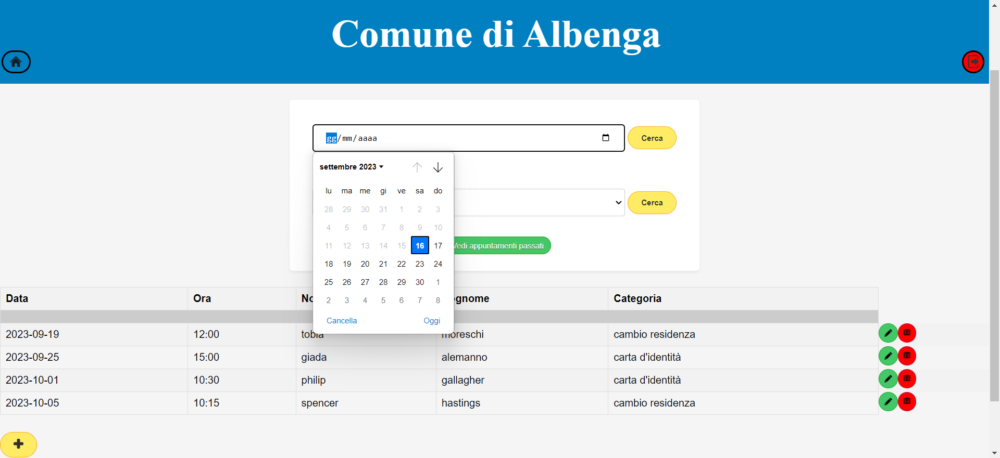

# Sportello comunale

*Sportello comunale* è un progetto sviluppato con **Springboot** per il corso universitario *"Sistemi informativi su web"*

## Sviluppo

- Java: **17.0.8**
- Springboot: 
- PostreSql
- Html
- CSS

## Struttura
Il progetto simula un sito di gestione appuntamenti comunali, è accessibile da un **amministratore** per la gestione di **prenotazione**

## Amministratore

- *inserisce* nuove prenotazioni
- *visualizza* le prenotazioni del **giorno** e **future**
- *visualizza* le prenotazioni **passate**
- *modifica* o elimina le *prenotazioni*
- *visuallizza* le prenotazioni per un **giorno** o una **prestazione** specifica

